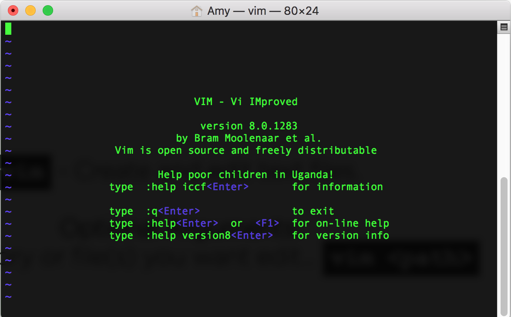

## Keeping Track of Your Projects 

(Intro to Version Control and Related Topics)
  

### Amy Howes  <!-- .element: class="dark" -->
https://github.com/thecodeferret/intro-to-git

---

## Welcome!
_Girl Develop It is here to provide affordable and accessible programs to learn software through mentorship and hands-on instruction._

---

## Some Rules

* We are here for you&mdash; ask questions!
* Every question is important.
* Help each other.
* Have fun.
 

---

##Tell us about yourself
<ul>
<li>Who are you?</li>
<li>What do you hope to get out of the class?</li>
<li>What is your favorite animal?</li>
</ul>

---

##Join Us On Slack
<a href="http://slack.gdicincy.com/" target="_blank">http://slack.gdicincy.com</a>
---

## Class Overview

* What is version control?
* Using the command line
* Git in practice

---

## The Problem

Software projects have lots of files and often require multiple developers making updates to the same codebase.

Leads to bugs, accidental overwrites. <!-- .element: class="fragment" -->

* Who changed what? when? <!-- .element: class="fragment" -->
* How to merge your code and mine? <!-- .element: class="fragment" -->
* Collaborating remotely is hard. <!-- .element: class="fragment" -->

---

## The Solution

**"Version Control"** is a system that records changes to files over time.

* Track every change to every file. <!-- .element: class="fragment" -->
* Manage multiple versions of file(s). <!-- .element: class="fragment" -->
* Who added/edited/deleted what? <!-- .element: class="fragment" -->
* Attach descriptive messages to each change. <!-- .element: class="fragment" -->

---

## Types of Version Control

Over the years, different strategies for version control have evolved.

Two types of version control systems:

**Centralized** and **Distributed**

---

## Centralized

Assumes a single "central" copy of your project somewhere (probably on a server), and programmers will "commit" their changes to this central copy.  

_Examples include **Subversion, CVS** and **SourceSafe**_

---

## Distributed

Doesn't rely on a central server. Every developer "clones" a copy of a repository and has the full history of the project on their own hard drive.  
 

_Examples include **Bazaar, Mercurial** and **Git**_

---

## Why Git?

...designed to manage everything for small or large projects with speed &amp; efficiency.

1. Easy to learn <!-- .element: class="fragment" -->
1. Provides multiple development workflows <!-- .element: class="fragment" -->
1. Open source <!-- .element: class="fragment" -->

---

##  More About Git

Created by Linus Torvalds in 2005 for Linux Kernel Development

1. Very fast and efficient <!-- .element: class="fragment" -->
1. Cheap local branching <!-- .element: class="fragment" -->
1. Works great remotely <!-- .element: class="fragment" -->
1. Popularized by Github <!-- .element: class="fragment" -->

---

## Getting Git

* **OSX:**  
  Download [Git for Mac](http://git-scm.com/download/mac)

* **Windows**  
  Download [Git for Windows](https://git-for-windows.github.io/)

---

## Getting Git

There are also some GUIs for Git...

* [Github for Mac and Windows](https://desktop.github.com/)
* [and many more...](https://git.wiki.kernel.org/index.php/InterfacesFrontendsAndTools#Graphical_Interfaces)

---

## What is Github?

Github helps you visualize your repository while providing some powerful collaboration and code management tools.

* Forks &amp; Pull Requests <!-- .element: class="fragment" -->
* Issues <!-- .element: class="fragment" -->
* Wikis &amp; Github Pages<!-- .element: class="fragment" -->
* Organizations <!-- .element: class="fragment" -->
* Releases &amp; Tags <!-- .element: class="fragment" -->
* ...and more <!-- .element: class="fragment" -->

---

## Questions?

---

## Intro to Command Line

---

## A Brief History Lesson

A Unix "shell" is a command-line interpreter that provides a traditional user interface for the Unix operating system and for Unix-like systems.
  
* There are a [bunch of different shells](http://www.ibm.com/developerworks/library/l-linux-shells/figure1.gif)... Bourne shell, C shell, Korn shell, Z shell, etc.
* The first major shell was the Bourne Shell, developed in the late 70's.
* We're going to focus on the "Bourne again shell" or _Bash_ (default shell for OSX and Linux)

  

_Hint: You can install Bash bindings in Windows via [Git for Windows](https://git-for-windows.github.io/)_

---

## Why Bash?

* A fully-capable scripting language
* Vast adoption (approximately [70% of public servers](https://en.wikipedia.org/wiki/Usage_share_of_operating_systems#Public_servers_on_the_Internet) are Unix or Unix-like)
* Tons of command line features...
    * Tab completion
    * Pipes
    * Aliases
    * Environment variables
    * Startup scripts
    * ...and more!

---

## Essential Commands

In this next part, we'll learn some basic commands that we can use to interact with our Bash shell.

The outline below is provided as a handy reference of the commands we'll cover in class. [This tutorial](http://programminghistorian.org/lessons/intro-to-bash) contains alot of additional information if you're confused or just curious.
&nbsp;  

---

`pwd` - Display your _"present working directory"_.

---

`ls` - Display the contents of a directory specified by `<path>`.
  
__Optional Flags:__  
Long listing (with details)...  `ls -l`  
 
List all files...  `ls -a`

__Optional Arguments:__  
Apply to files or directories... `ls <path>`

__Hint:__  
You can use the wildcard character too... `ls *.txt`

---

`man` - Display documentation for a given command. _"Man" is short for "manual"._
  
__Required Arguments:__  
The command to display documentation for... `man <command>`
  
__Hints:__  
Exit a man page by pressing the 'q' key on your keyboard.

---

`cd` - Change to directory specified by `<path>`
   
__Optional Arguments:__  
The location to move to... `cd <path>`
   
__Special Characters:__  
Move to the parent directory... `cd ..` 
   
Return to previous working directory... `cd -`  
 
Root of filesystem... `cd /`  Your home directory... `cd ~` or `cd --`  

---

`open` - View directory or file specified by `<path>`.
  
 __Required Arguments:__  
Directory or file... `open <path>`
  
__Special Characters:__  
A dot character refers to the current directory... `open .`
  
__Note For Windows Users...__  
Use this command instead... `explorer .`

---

`mkdir` - Make a new directory.  
  
__Required Arguments:__  
The name of the new directory... `mkdir <name>`
  
__Optional Flags:__  
Create intermediate directories as required. ... `mkdir -p <path>`  

---

`wget` - Download a file.
  
__Required Arguments:__  
File url... `wget <url>`
   
__Hint:__  
Try executing this... <pre><code>`wget http://www.gutenberg.org/files/2600/2600-0.txt`</code></pre>
 
__Note for Mac Users:__  
If you don't have `wget` try this... <pre><code>`curl -O  http://www.gutenberg.org/files/2600/2600-0.txt`</code></pre>

---

`cat` - Concatenate and print files
  
__Required Arguments:__  
The file to concatenate... `cat <file>`
  
__Hint:__  
Path multiple paths to concatenate files... `cat <file> <file>`
  
__Special Characters:__  
Send output to a new file... <pre><code>`cat file1.txt file2.txt > combined.txt` </code></pre>
Wildcards... <pre><code>`cat *.txt > all-the-files.txt`</code></pre>
---

`head` - Show the first ten lines of a file.
  
__Required Arguments:__  
The file to display... `head <file>`
  
__Optional Flags:__  
Specify `n` lines... <code>head -n 25 [file]</code>

---

`tail` - Show the last ten lines of a file.
  
__Required Arguments:__  
The file to display... `tail <file>`
  
__Optional Flags:__  
Specify `n` lines... `tail -n 25 [file]`

---

`mv` - Move (or rename) a file or directory  
  
__Required Arguments:__  
The target and destination... `mv <target> <destination>`

---

`cp` - Copy a file or directory  
 
__Required Arguments:__  
The target and destination... `cp <target> <destination>`
 
__Optional flags:__  
Copy recursively (directories)... `cp -R`  

---

`rm` - Remove files and directories  
  
__Required Arguments:__  
The file or directory to remove... `rm <path>`
  
__Optional Flags:__  
Remove recursively (directories)... `rm -r`  

---

`history` - Show command history
    
__Special Characters:__  
Recall previous command... `!!`  
Repeat command in your history... `!<linenumber>`  

---

`vim` - Create and edit text files.
  
__Optional Arguments:__  
The directory or file(s) you want edit... `vim <path>`

---

## Editing Text Files with Vim

Vim (which stands for Vi-improved) is a heavy-duty text-editor alot of developers use full-time.

---

## Heads Up!

It is, admittedly, confusing as hell for new users because it relies solely on keyboard shortcuts to navigate the interface. But it's installed almost everywhere (and is generally the default editor on most Unix-esque systems) so its worth being familiar with.

---  

### Entering Insert Mode

The trickiest part about using `vim` is understanding that there are multiple "modes". The current mode you're in determines what features are available. For example– if you want to edit an open file, you'll need to enter "insert mode" by pressing the `a` key or `i` key on your keyboard.
  
You can tell that you're in "insert mode" if you see `-- INSERT --` displayed in the bottom left corner of your editor window. Once you're in "insert mode" you can type normally and move the cursor around the window with your arrow keys.

---  

### Saving Your Edits

After you make your edits, you'll probably want to save them right? To do this, you first need to exit "insert mode" by pressing the `esc` key on your keyboard.
  
Next you issue a couple keystrokes in order to tell Vim you want to save your changes. Type the following characters and hit enter to "write" your changes to disk... `:w` (that is a colon followed by the letter w).

---

### Exiting Vim

Closing your open file is alot like saving your edits above. Type the following characters and hit enter to "quit" vim... `:q` (colon then the letter q).
  
You can also combine these two actions into one like so... `:wq`

---

### Common Tasks

You can create a new file or open an existing file the same way. Just pass a filename as the first argument to the `vim` command...

    $ vim some-filename

--- 

Here's list of common keyboard shortcuts, the vast majority of which are not applicable .

__`i`__ or __`a`__ - Enter insert mode  
__`v`__ - Enter visual mode  
__`esc`__ - Exit your current mode  

__`Ctrl + f`__ - Page down  
__`Ctrl + b`__ - Page up  
__`gg`__ - Go to the top of the file  
__`G`__ - Go to the bottom of the file  
__`0`__ - (zero) Go to beginning of line  
__`$`__ - Go to end of line 

__`:w`__ - Write changes to a file  
__`:q`__ - Quit vim  
__`:wq`__ - Write and quit 

---

__`cw`__ - Change word and enter insert mode  
__`yy`__ - Copy current line  
__`dd`__ - Delete current line  
__`p`__ -  Paste  
__`u`__ - Undo  
__`Ctrl + R`__ - Redo  

__`k`__ or __`↑`__ - Move cursor up  
__`j`__ or __`↓`__ - Move cursor down  
__`l`__ or __`→`__ - Move cursor right  
__`h`__ or __`←`__ - Move cursor left  

---

## Intro to Git and Github

---

### Setup
  
1. Download starter kit... http://bit.ly/intro-to-git-starter-kit
  
2. Open a new Bash window and `cd` in to the starter kit's directory

First, let's personalize Git by setting some configuration values...

<pre><code>`git config --global user.name "Your Name"`</code></pre>  
<pre><code>`git config --global user.email "your_email@whatever.com"`</code></pre>

---

### Local Workflow

Git will track the contents of every file within a directory.

* What changed?
* When did it change?
* Who changed it?

As you're working on the files, you can create "save-points" (aka "revisions"; aka "commmits").  

If you ever make a mistake, you can recover a previous state of a file.

---

`git init`

* Initializes a new "repository"
* Tells git to keep track of changes in your current directory
* Try: `ls -la .git`

---

`git status`

* Shows what has changed since our last commit.
* Use this command constantly.
* <strong>Top of your “how do I figure out what happened” tools</strong>
* Try: `git status -s`

---

##**_Creating a save-point is a two-step process..._**  

> * You "stage" your changes before "committing" your changes.
> * Staged files will be included in the next save-point.
> * Helps with organizing your files.

---

##Step 1:

`git add`

* Adds the specified files to the stage (i.e. tell Git to incude this file in the next save-point).
* `git add .`

---

##Step 2:

`git commit -m "initial commit."`

* Create a new save-point by commiting our changes to the repository.
* Use the `-m` flag to pass commit message inline.

---

`git log`

* See all the save-points over the lifetime of this repository.
* It's your safety net– you can always get back to anything.

---

 **_Demo_:**  
1. Add new `README.md` and update `index.html`  
2. Make two seperate commits to illustrate staging area.

_(Checkout `git log -p`)_ <!-- .element: class="fragment" -->

---

`git reset <filename>`

* Remove a file from the stage.

`git diff`

* Displays changes since the last save-point

---

## **_In-class Exercise (5 minutes)_:**  
1. Edit some files  
2. Stage your changes  
3. Commit your changes

---

Undoing the last commit:

`git reset HEAD~1`

  

Discarding local changes:

`git checkout .`

<a href="https://stackoverflow.com/questions/14460595/git-checkout-with-dot" target="_blank">A little more about this command</a>

---

### Remote Workflow

Why would you use remote repos?

* Collaboration
* Backups
* Deployment
* Automated Services

  
Each repository can have multiple "remotes", you refer to them with aliases.  
  
Github is just another remote repository.

---

##**_In-Class Exercise (5-minutes)_:** 

Create a New Github Repo

1. Login to Github.
2. Create a new public repository.
3. Follow on-screen instructions to add remote to your local repository.
4. Push changes to Github.
5. Checkout how you can clone.

---

`git clone`

* Creates a "clone" of a remote repository.
* Copies the entire commit history to your computer.

---

`git push <remote-alias> <branch-name>`

* Push code on specific branch to a remote repository.
* Copies your entire commit history to the remote.

---

 **_Demo_:**  
1. Edit a file on Github.  
2. Pull it's changes down.  

---

`git pull <remote-alias> <branch-name>`

* Copies updates from a remote repository to your computer.
* Git will try to automatically merge your code.

---

##**_Did You Know?_**  
There are three ways to start a new project...
    
1. `git init`  
2. `git clone`  
3. Fork a repository and `git clone`

---

### Branches

* Git automatically calls the main branch “master”.

---

**_Demo_:**  
1. Draw a linear-picture of what branches look like.

---

Create a new branch:

`git branch <branch-name>`

See all the branches:

`git branch`

Checkout a specific branch:

`git checkout <branch-name>`

Delete a branch:

`git branch -D <branch-name>`

---

### Merging

`git merge <branch-name>`

* Merging combines the histories of two branches.
* Git will try to automatically merge your code.

Conflicts happen when Git doesn't know how to merge your code.

They look like this... 

    <<<<<<< HEAD
    This was once a test, but is no longer.
    =======
    This is a test.
    >>>>>>> some-branch-name

When you encounter a conflict, you need to edit the file by hand.

---

##**_In-Class Exercise_:**  
1. Create a merge conflict by editing the same file on two branches.  
2. Merge the branches.  
3. Resolve the conflict.

---

### Forks and Pull-Requests

These are Github specific terms (though other platforms have adopted them).

* A "fork" is clone of a repository to your Github account.
* A "pull-request" is a formal request to merge forked code back into the original repo.

---

##**_In-Class Exercise_:**  
1. Create a new fork of... [girldevelopitcincinnati/memehub](https://github.com/girldevelopitcincinnati/memehub)  
2. Clone the fork and add new animated gif the respository.  
3. Submit a pull-request.

---

##Congrats!
You did it! 

